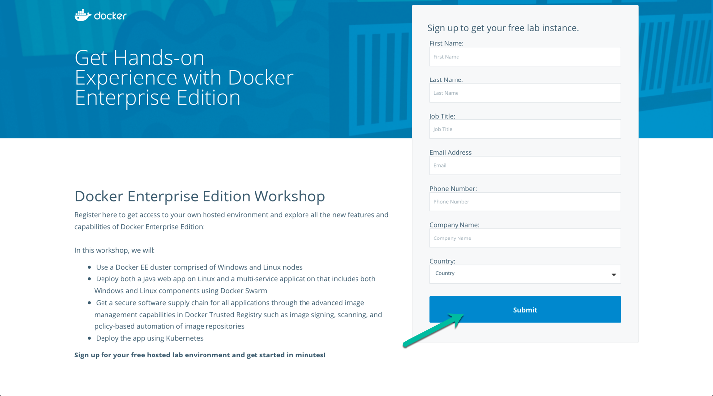
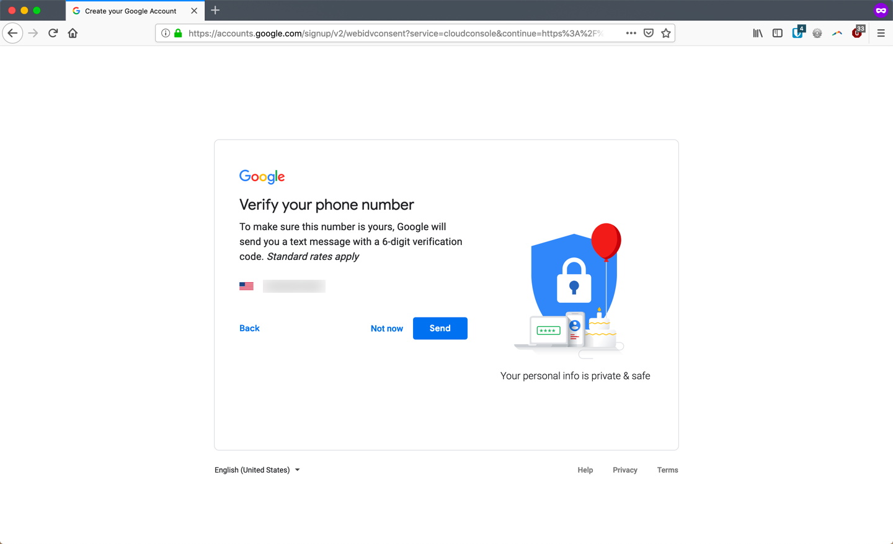
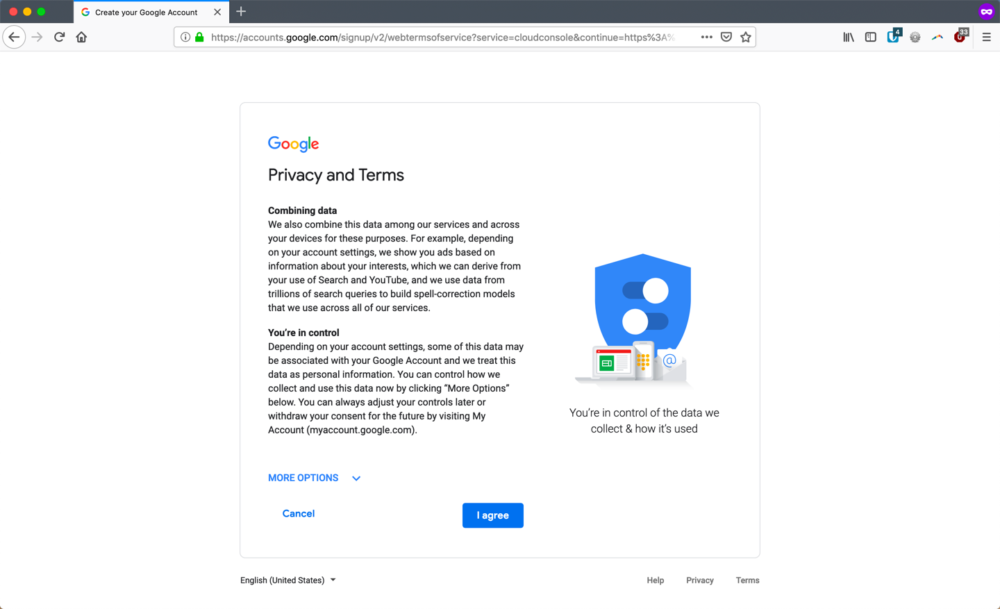
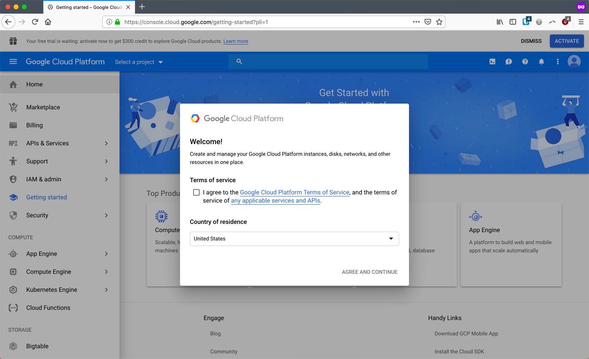
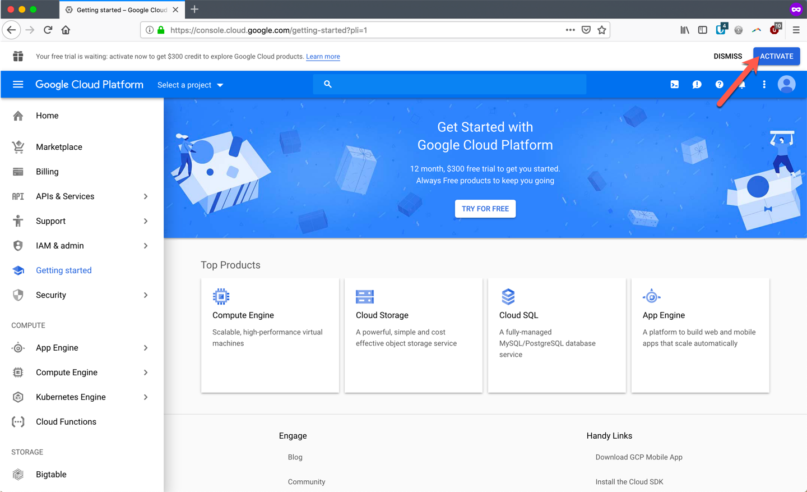
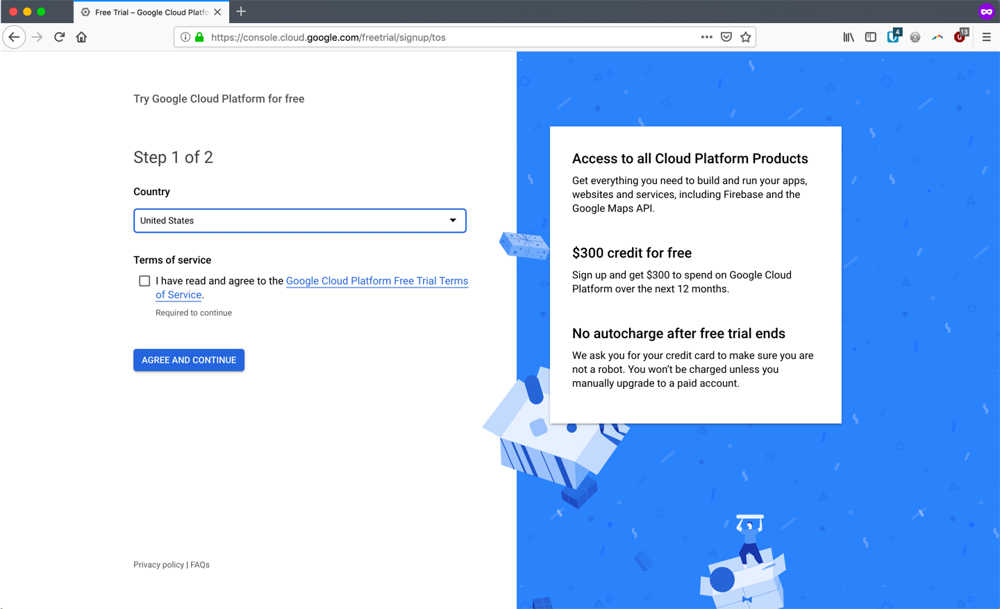
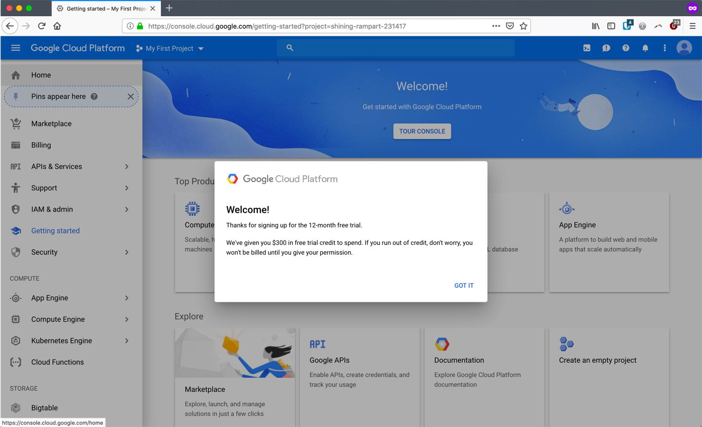

Welcome to Lab 01
---

In this lab, we'll sign up with Google Cloud Platform (GCP) for this workshop. You should sign up for a new account and utilize the $300 credit. Only new accounts can be supported by the workshop instructors as pre-existing accounts may have security or other restrictions which may otherwise prevent you from completing this workshop.

Note: These steps may vary slightly based on your region / locality

01. Visit https://console.cloud.google.com and click on `Create account`

02. Fill in your details, include a valid email address which hasn't been used to sign up for GCP in the past.

03. Enter your phone number and personal details (don't worry, Google says they're private & safe). Google will send a validation code to the phone number you provide.

04. Agree to the Privacy Terms

05. Click the activate button for a $300 credit to your account

06. Fill in details for the $300 free credit

07. You're ready to get started with Lab 02 where we'll setup Google Kubernetes Engine (GKE)

